# SeaDesktop_public

## Yaml example

```
project:
  name: SeaDesktopDemo1

services:
  - name: CCNBService
    port: 8081

    database:
      type: memory

    entities:
      - name: User
        options:
          enable_crud: true
          enable_auth: true
        fields:
          - name: id
            type: uuid
            required: true
            unique: true

          - name: email
            type: string
            semantic: email
            required: true
            unique: true

          - name: password
            type: string
            semantic: password
            required: true
            serializable: false

          - name: full_name
            type: string
            required: true

          - name: role
            type: string
            required: false

      - name: Department
        options:
          enable_auth: true
        fields:
          - name: id
            type: uuid
            required: true
            unique: true

          - name: name
            type: string
            required: true
            unique: true

        relations:
          - name: employees
            kind: has_many
            target_entity: Employee
            fk_column: department_id
            on_delete: cascade

      - name: Employee
        options:
          enable_auth: true
        fields:
          - name: id
            type: uuid
            required: true
            unique: true

          - name: name
            type: string
            required: true

          - name: email
            type: string
            semantic: email
            required: true
            unique: true

          - name: age
            type: int
            required: false

          - name: department_id
            type: uuid
            required: false

        relations:
          - name: department
            kind: belongs_to
            target_entity: Department
            fk_column: department_id
            on_delete: restrict

      - name: Student
        options:
          enable_auth: true
        fields:
          - name: id
            type: uuid
            required: true
            unique: true

          - name: name
            type: string
            required: true

          - name: email
            type: string
            semantic: email
            required: true
            unique: true

          - name: age
            type: int
            required: false

        relations:
          - name: programs
            kind: many_to_many
            target_entity: Program
            pivot_table: StudentProgram
            source_fk_column: student_id
            target_fk_column: program_id
            on_delete: cascade

      - name: Program
        options:
          enable_auth: true
        fields:
          - name: id
            type: uuid
            required: true
            unique: true

          - name: name
            type: string
            required: true
            unique: true

        relations:
          - name: students
            kind: many_to_many
            target_entity: Student
            pivot_table: StudentProgram
            source_fk_column: program_id
            target_fk_column: student_id
            on_delete: cascade

      - name: StudentProgram
        options:
          enable_auth: true
        fields:
          - name: id
            type: uuid
            required: true
            unique: true

          - name: student_id
            type: uuid
            required: true

          - name: program_id
            type: uuid
            required: true
```
## images:


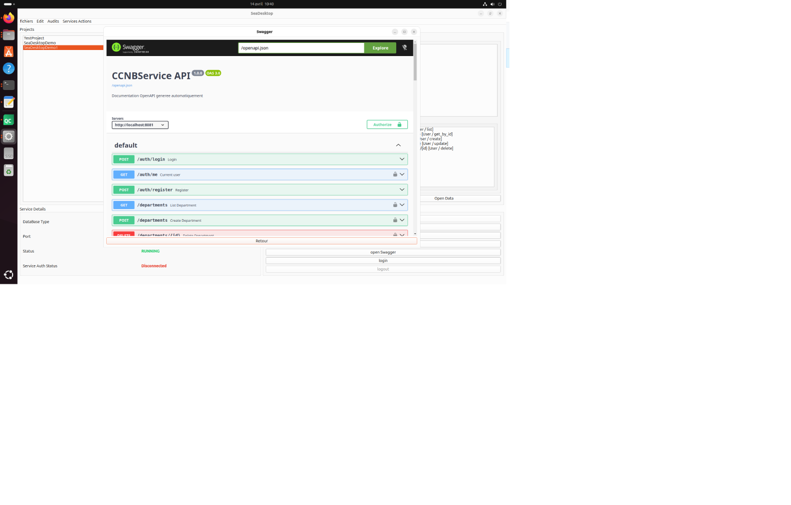

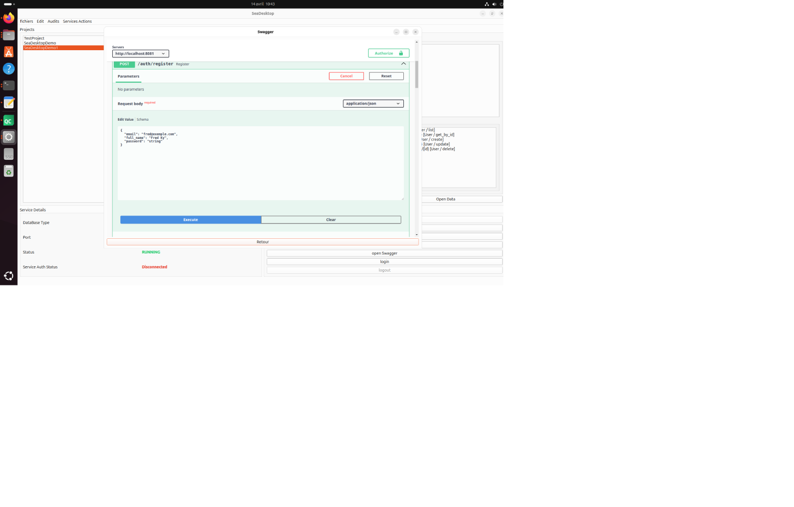

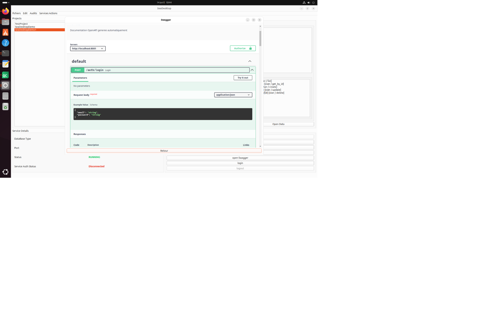

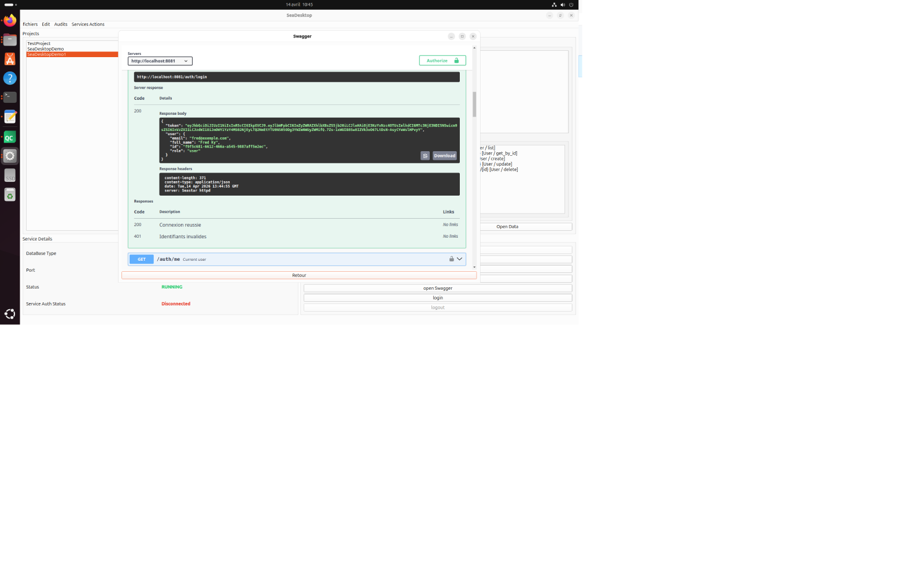

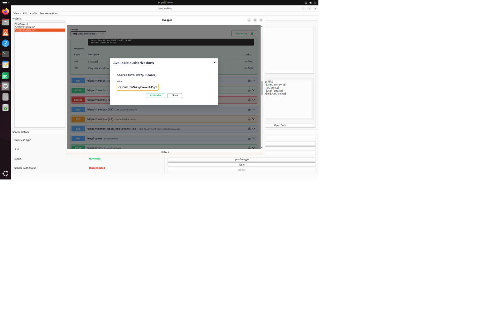

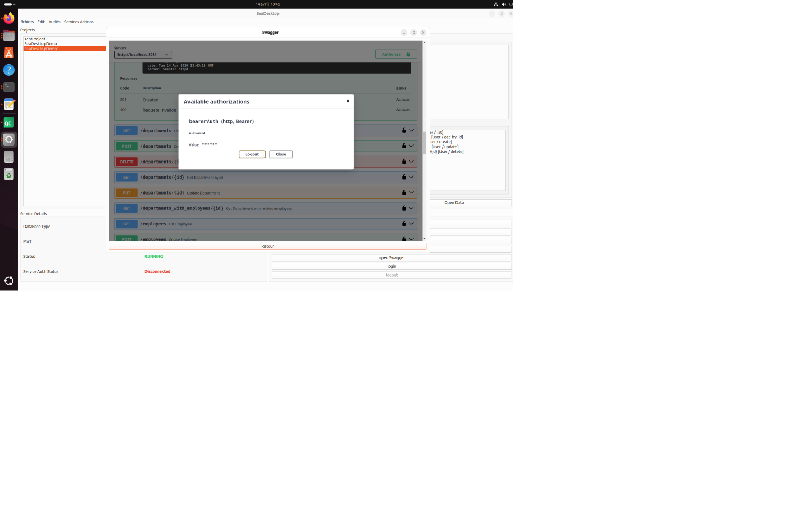

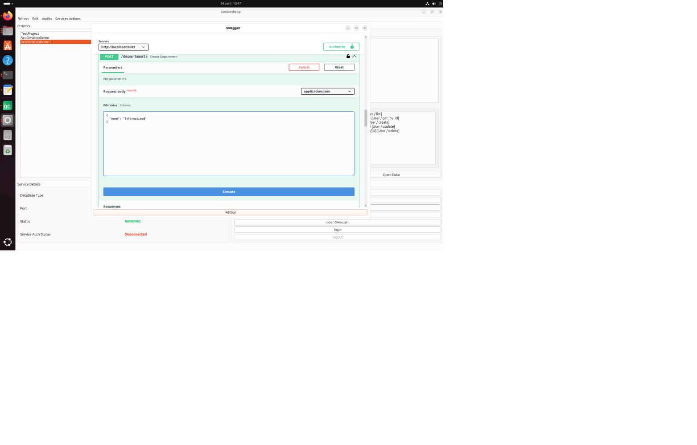

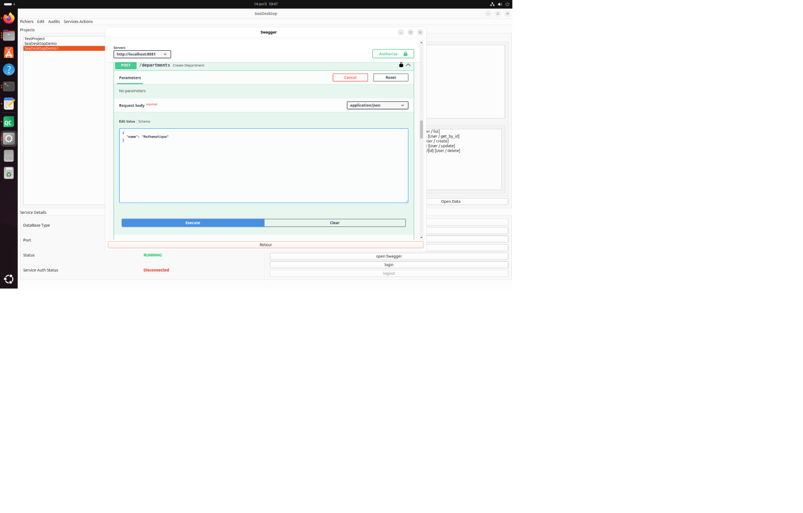

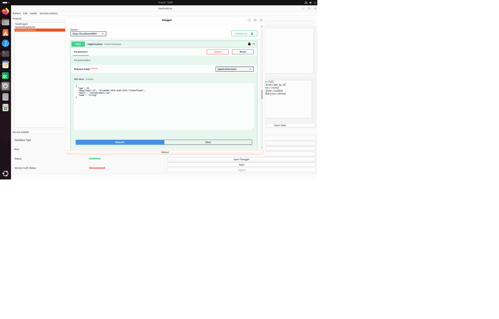

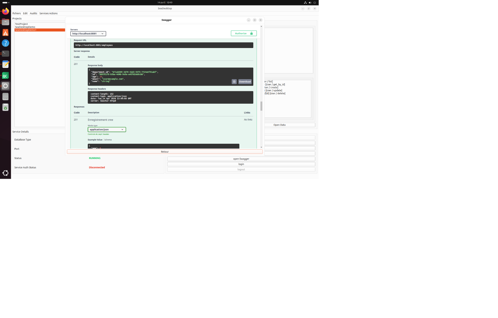

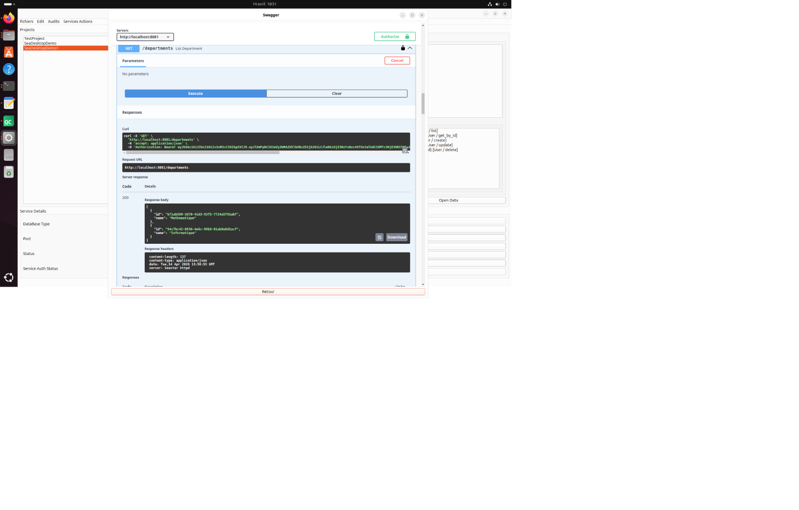

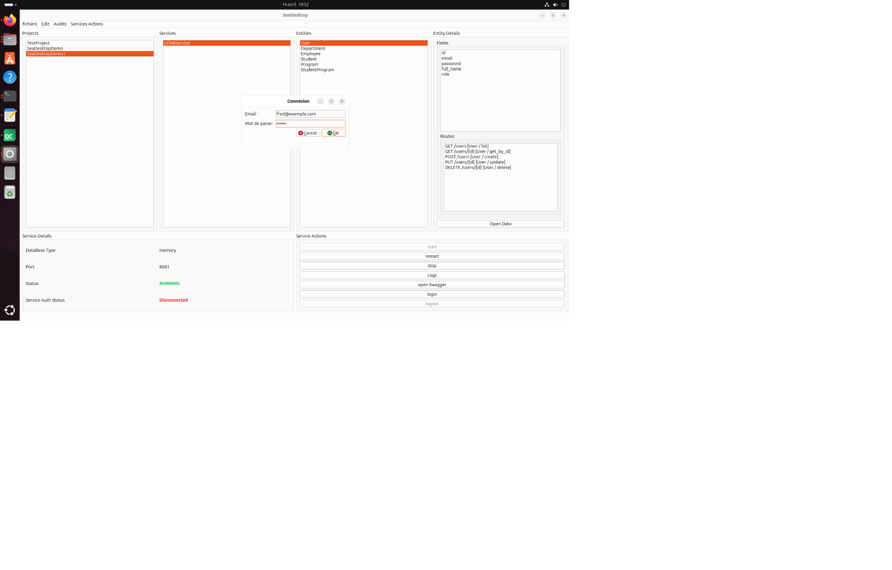


